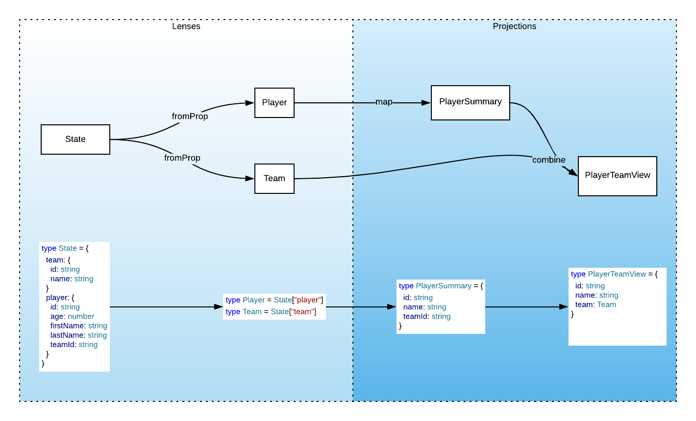
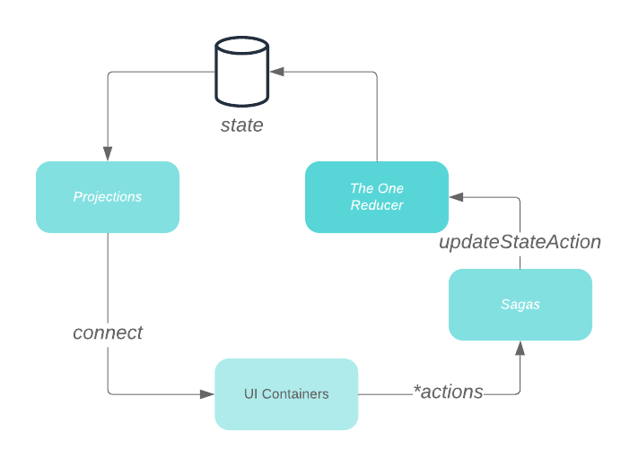

# Projectors
Projections is a thin abstraction on top of Lenses, inspired by reselect, designed to solve a set of problems regarding the manipulation of large and nested objects such as Redux stores.
While Lenses solve problems regarding basic CRUD operations on data objects, Projections are readonly views into the data, allowing for tranformation(`map`) and merging(`combine`) of projections and lenses.

## Use case
The main struggle that this project aspires to resolve is the verbosity required by Redux. Redux is simple and yet a robust solution for state management. When reducers are just anemic  CRUD operations, it minimizes data indirection and increases maintainability of the app.

Lenses is viable alternative to catalize the Redux by removing verbosity, allowing the write operations to the state to handled by a single reducer([Lenses Reducer Module](https://example.com)). 

Furthermore, Lenses play a fair share part in the selectors space. The same lenses created for modification of state can be used to read data(`get`). However, lenses may not suffice all requirements related to the read operations. 

Operations that combine different parts of the store(`combine`) and different modifications of its shape(`map`) are quite common. Besides, some transformation can be computational expensive and especially when run repeateadily, they can become bottlenecks.
Projections solve both of these problems:
1) They are **memoized** by default; and
2) They can combine(merge) multiple projections or lenses into new projections.